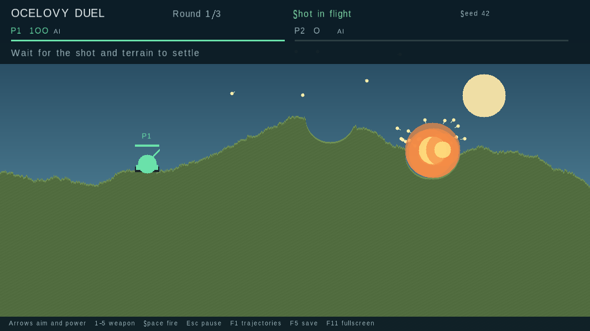

# Ocelovy Duel

A C++17 artillery game with destructible terrain, local multiplayer, AI opponents,
and verifiable match replays. Aim a tank, choose a weapon, and use both direct hits
and collapsing ground to eliminate opponents. The default is one human versus one
AI over three rounds; matches support 2–9 players and 1–9 rounds.



[Watch the gameplay demo](docs/gameplay.mp4) · [Architecture](docs/architecture.md) ·
[Verification and benchmark results](docs/verification.md)

## Build and play

Requires a C++17 compiler, CMake 3.16+, SDL2 2.0.18+, and libpng with its simplified
PNG API. Python 3 enables CLI integration tests. No downloaded C++ dependencies
are needed. On Debian/Ubuntu:

```sh
sudo apt-get install build-essential cmake pkg-config libsdl2-dev libpng-dev python3
make
./program
```

Alternatively, open `CMakeLists.txt` in Qt Creator, or build directly:

```sh
cmake -S . -B build/release -DCMAKE_BUILD_TYPE=Release
cmake --build build/release --parallel
./build/release/ocelovyduel --seed 42
```

The graphical frontend uses SDL2. The simulation library has **no SDL dependency**:

```sh
make headless
./build/headless/ocelovyduel --headless --seed 42 --players 4 --rounds 3 --difficulty hard
```

## Controls and rules

| Input | Action |
|---|---|
| Left / Right | Rotate the barrel |
| Up / Down | Increase / decrease power |
| 1–5 | Select weapon |
| Space | Fire; pause during replay playback |
| Enter | Continue after a round; activate selected menu button |
| Esc | Pause / return |
| F1 | Show AI candidate trajectories and search counts |
| F5 | Save a replay of completed shots |
| F11 | Toggle fullscreen |

Menus support both the mouse and Up/Down + Enter. Human players occupy the first
player slots and share the keyboard. Set human players to zero to watch AI play.
Difficulty changes AI search effort and aiming error. Losing window focus pauses
play. A turn finishes only after all projectiles, explosions, and falling terrain
have settled. Each player earns one win per round; tied win totals remain a draw.
A round with no survivors, or 200 shots without a winner, is drawn.

| Key | Weapon | Per-round supply | Behavior |
|---|---|---|---|
| 1 | Shell | Unlimited | Standard ballistic shell |
| 2 | Rocket | 3 | Flatter arc and larger blast |
| 3 | Bouncer | 3 | Up to three terrain bounces |
| 4 | Cluster | 2 | Splits into twelve shells on impact |
| 5 | Ultimate | 1 | Bounces twice, releasing eight rockets at each impact |

Explosions apply radial damage once, destroy circular areas of soil, and can
trigger tank death explosions. Falling damage starts after a 12-pixel drop.
The game retains the prototype's three terrain families, tank shapes, and font
atlas; weapon behavior has been bounded and rebalanced for complete matches.
The unfinished money/shop screen is replaced by round standings.

## Record and replay

```sh
./program --seed 42 --record match.odr
./program --replay match.odr
./program --verify match.odr
./program --headless --seed 42 --rounds 3 --record bots.odr
```

With `--record`, completed shots are saved after each turn. F5, leaving a match,
or closing the normal game saves to `last-match.odr` when no path was supplied.
An unfinished shot is omitted; partial replays are valid. Existing files at the
chosen path are replaced. File writes use a temporary file and rename so a failed
write does not truncate the previous replay.

Replays contain a versioned configuration, accepted shot commands, and a state
checksum after every resolved shot. Playback runs the simulation again and stops
on the first mismatch. **Repeatability is supported within the same build.**
Floating-point behavior, compiler differences, and future physics changes may
invalidate older replays; cross-platform determinism is not promised. Checksums
detect divergence, not malicious tampering.

## Verify and package

```sh
make test
make sanitize
make benchmark
make package
```

The tests cover seeded generation, gravity against a full-grid reference,
out-of-bounds terrain access, command validation, all five weapons, turn limits,
render-rate independence, AI search, replay round trips and corruption, and
repeated restarts. GitHub Actions builds and tests Linux, runs a graphical smoke
test with SDL's dummy driver, checks ASan/UBSan, and uploads a release archive.

`make package` creates a native Linux `.tar.gz` in `build/release/`. Extract it and
run its `ocelovyduel` executable. The original font atlas must remain beside the
executable. Runtime SDL2 and libpng libraries must be installed. This is a native
build, not a portable AppImage or a verified Windows/macOS release.

To generate demo material without a desktop:

```sh
SDL_VIDEODRIVER=dummy SDL_RENDER_DRIVER=software ./program \
  --seed 42 --smoke 1800 --capture build/capture --screenshot build/gameplay.png
ffmpeg -framerate 20 -i build/capture/frame-%05d.png \
  -vf 'pad=ceil(iw/2)*2:ceil(ih/2)*2' -c:v libx264 -pix_fmt yuv420p build/gameplay.mp4
```

`--smoke` uses a fixed 60 Hz presentation schedule and exits after the requested
frame count. It defaults to AI players and does not write a replay unless
`--record` is supplied. `--smoke-input FILE` starts at the menu and accepts ordered
`frame press|down|up SDL-key-name` lines, for example `0 press Return` and
`30 press Space`. This drives the normal SDL event handler for menu and human-input
regressions; an empty script captures the setup screen. `--help` lists every option.
