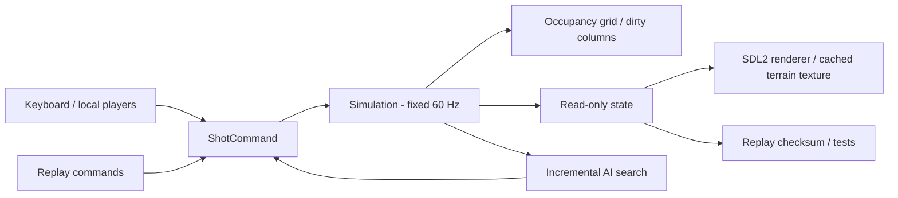

# Architecture

The project is split into a dependency-free C++ simulation library and an SDL2
application. `include/duel` is the public core interface; `src/renderer.*` and
`src/frontend.cpp` are the graphical adapter. Tests and the CLI run without a
window or graphics initialization.



## Simulation and ownership

`Simulation::fire()` accepts one validated command while aiming. `tick()` advances
one fixed step; it never reads a wall clock or calls SDL. The frontend uses an
accumulator and caps catch-up after long stalls. Drawing only reads state.

```text
Aiming -> Flight -> Explosions -> Settling -> Aiming
                                      \-> RoundOver -> nextRound()
                                      \-> MatchOver
```

New explosions caused by falling tanks return to the explosion phase before
settling resumes. Player slots stay in a vector for the entire match; elimination
changes health rather than erasing elements or invalidating the active player.
Projectiles and explosions are values. Fragmentation processes a detached batch,
so adding children cannot invalidate an iteration. SDL resources have RAII owners.

Projectile movement samples each movement segment at intervals of at most one
pixel. It checks both terrain and live tank circles, with a short launch grace
period for the firing tank. Projectiles expire after 900 ticks or when leaving
the horizontal world. Every resolved shot has a 2400-tick safety budget.

## Terrain

Midpoint displacement generates hills, mountains, and desert profiles from an
explicit seed. A column-major byte grid preserves overhangs and holes. Craters
invalidate only the columns they modify. Gravity moves soil down one pixel per
tick, visiting only unsettled columns; cached surface heights support placement.

The renderer tracks per-column revision counters. It updates a CPU texture buffer
only for changed columns, uploads the affected horizontal span, and reuses that
texture between changes. The benchmark compares gravity to a deliberately simple
full-grid implementation of the same rule, asserting identical final cells and
step counts. Unit tests additionally compare every intermediate step.

## AI

Easy/normal/hard use angle grids of 9/17/25 points and power grids of 6/10/14
points, across available weapons. The trajectory pass uses the same integrator
and collision checks as gameplay, with the current terrain held fixed. It ranks
potential enemy damage, self-damage, proximity, and ammunition cost. Local search
refines the best candidates. The top 2/4/6 finalists each run a full copied
simulation including fragments, craters, falling damage, and chain reactions.

Full outcomes determine the final choice. Easy and normal add deterministic
aim/power error; hard adds none. This is a bounded heuristic, not exhaustive
optimal play. The coarse pass can miss useful terrain destruction tactics.
The GUI evaluates at most 32 trajectory candidates, or one full finalist, per
frame. This bounds the amount of search work scheduled per frame, but it is not
a hard real-time deadline. AI randomness is separate from authoritative gameplay
randomness, and replay playback uses recorded commands rather than rerunning AI.

## Replay interface

Version 1 is a bounded text format:

```text
OCELOVY_DUEL_REPLAY 1
seed players humans rounds terrain difficulty
shot_count
round player angle power weapon resulting_hash
...
```

Enums and player IDs are zero-based. Doubles are written with round-trip precision.
The parser checks configuration ranges, finite aiming values, line length,
record count, truncation, and extra fields. The simulation then validates turn
order, ammunition, and phase. At each turn boundary it compares the resulting
64-bit FNV-style checksum, including terrain, RNG state, counters, and tanks.
Waiting in aiming or round screens changes no authoritative state. This lets
replays omit wall-clock input timing while still checking every completed shot.

No network multiplayer or claim of cross-platform bit-identical physics is part
of this version. Deterministic fixed-point math and protocol negotiation would
be separate future work if networking becomes a requirement.
